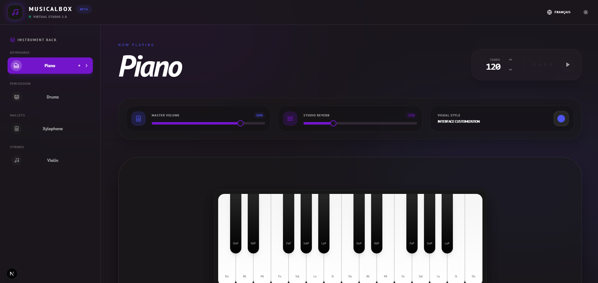

# 🎹 MusicalBox

> **BETA – Virtual Studio 2.0**

MusicalBox is an interactive virtual music studio accessible directly from your browser.  
It allows users to play multiple instruments, adjust audio effects, and experiment with sound in real time through a modern studio-inspired interface.
### [Open in your browser](https://musicalbox.geek-inc.xyz)

---

# 📸 Preview



---

# 🧠 Description

MusicalBox transforms your browser into a fully interactive music studio.

With MusicalBox, you can:

- 🎹 Play an interactive **Piano**
- 🥁 Use a realistic **Drum Kit**
- 🎼 Experiment with a **Xylophone**
- 🎻 Play a **Violin**
- 🎛️ Adjust **Master Volume**
- 🌊 Modify **Studio Reverb**
- ⏱️ Control **Tempo (BPM)**
- 🎨 Customize the visual interface style
- 🌍 Use multi-language support

---

# 🚀 Features

## 🎼 Available Instruments
- Piano
- Drums
- Xylophone
- Violin

## 🎚️ Audio Controls
- Master Volume
- Studio Reverb
- Dynamic Tempo Control

## 🎨 Interface
- Modern studio-style dark UI
- Responsive design
- Smooth and fluid interaction
- Clean and minimal components

---

# 🛠️ Technologies Used

- Next.js 15  
- React  
- Tailwind CSS  
- ShadCN UI  
- Lucide React  
- Tone.js (Web Audio Framework)  
- Web Audio API  

---

# 📥 Local Installation

```bash
git clone https://github.com/YOUR-USERNAME/musicalbox.git
cd musicalbox
npm install
npm run dev
```

Then open:

```
http://localhost:3000
```

*(Adjust if your setup differs.)*

---

# 🧪 Testing

- Ensure Web Audio API is supported in your browser
- Test each instrument
- Verify volume, tempo, and reverb adjustments
- Confirm UI responsiveness across devices

---

# 👏 Contributing

Contributions are welcome!

1. Fork the repository  
2. Create a branch (`feature/your-feature`)  
3. Commit your changes  
4. Push to your branch  
5. Open a Pull Request  

---

# 🙌 Credits & Resources

MusicalBox is an open-source project born from a passion for music and code.  
Here are the resources that made this virtual studio possible:

## 🎧 Audio Engine
- **Tone.js** — Web Audio framework for sequencing and synthesis  
- **Salamander Grand Piano** — High-quality piano samples by Alexander Holm  
- **Acoustic Drum Kit** — Official Tone.js sample library  
- **Bellatrix Orchestra** — High-fidelity xylophone samples [(Source)](https://musical-artifacts.com/artifacts/3389)   

## 🎨 UI & Framework
- **Next.js 15** — React framework for performance and routing  
- **Tailwind CSS** — Modern utility-first styling  
- **ShadCN UI** — Elegant and accessible UI components  
- **Lucide React** — Minimalist icon library  

---

# 📄 License


© 2026 MusicalBox — A GEEK Inc. Project
